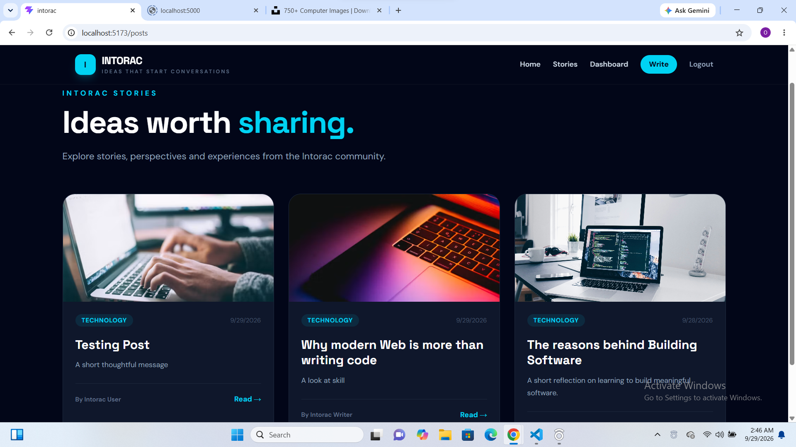

Intorac — Frontend

Intorac is a modern full-stack blogging platform designed for sharing ideas, stories, and conversations.

The frontend is built with React, React Router, Tailwind CSS, and Axios, and communicates with a RESTful backend API.

«Intorac — Ideas that start conversations.»

## 📸 Preview

✨ Features

- User registration
- User login and JWT authentication
- Protected routes
- Responsive navigation
- Browse published stories
- View individual stories
- Create blog posts
- Edit your own posts
- Delete your own posts
- Comment on stories
- Delete your own comments
- Personal dashboard
- My Stories management
- Responsive dark editorial interface
- Centralized Axios authentication
- Loading and error states

🛠️ Technologies

- React
- React Router DOM
- Tailwind CSS
- Axios
- Vite
- JavaScript (ES6+)

🏗️ Application Structure

src/
├── components/
│   ├── Navbar.jsx
│   ├── ProductCard.jsx
│   ├── ProtectedRoute.jsx
│   └── ...
│
├── context/
│   └── AuthContext.jsx
│
├── pages/
│   ├── Home.jsx
│   ├── Login.jsx
│   ├── Register.jsx
│   ├── Posts.jsx
│   ├── PostDetails.jsx
│   ├── CreatePost.jsx
│   ├── EditPost.jsx
│   └── Dashboard.jsx
│
├── services/
│   └── api.js
│
├── App.jsx
└── main.jsx

🔐 Authentication

Intorac uses JWT-based authentication.

After login, the frontend stores the authentication token and Axios automatically attaches it to authenticated API requests through an interceptor.

Protected routes include:

- Dashboard
- Create Post
- Edit Post

Unauthenticated users are redirected to the Login page.

🌐 API Configuration

The frontend uses a Vite environment variable for the backend API.

Create a ".env" file in the frontend root:

VITE_API_URL=http://localhost:5000/api

For production, configure the same variable in Vercel:

VITE_API_URL=https://your-intorac-backend.onrender.com/api

Do not commit your ".env" file to GitHub.

🚀 Installation

Clone the repository:

git clone YOUR-FRONTEND-REPOSITORY-URL

Navigate into the project:

cd intorac-frontend

Install dependencies:

npm install

Create your ".env" file:

VITE_API_URL=http://localhost:5000/api

Start the development server:

npm run dev

The application will normally be available at:

http://localhost:5173

🔌 Backend

The frontend requires the Intorac REST API to be running.

The backend provides endpoints for:

- Authentication
- Users
- Blog posts
- Comments

Make sure the backend server is running before testing authenticated features.

📱 Responsive Design

The interface is designed to work across:

- Mobile devices
- Tablets
- Laptops
- Desktop screens

The UI uses a dark editorial design with cyan accents to give Intorac a distinctive identity.

🧪 Core User Flow

Register
   ↓
Login
   ↓
Dashboard
   ↓
Create Story
   ↓
Publish
   ↓
View Story
   ↓
Comment
   ↓
Edit / Delete Story

📌 Project Purpose

Intorac was developed as a full-stack development project to demonstrate practical skills in:

- React frontend development
- REST API integration
- Authentication
- CRUD operations
- Database-driven content
- Protected routes
- User interaction
- Responsive UI development

👨‍💻 Developer

Oluwatobi Oluwagbohun

Full-Stack Developer

Portfolio:
https://my-personal-card-ebon.vercel.app/

CV:
https://my-cv-resume.vercel.app/

📄 License

This project was created for educational and portfolio purposes.